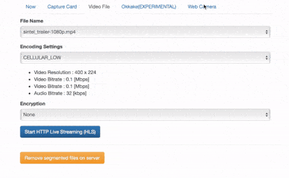
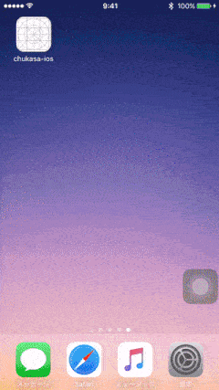

# chukasa 

Web camera, video file, PT2 and PT3 HTTP Live Streaming (HLS) Server for OS X and iOS

 

## Description

Web カメラの映像と音声，任意のビデオファイル，PT2 / PT3 の出力をリアルタイムにエンコードしながら HLS (HTTP Live Streaming) 形式で配信するウェブアプリケーションです．ストリーミングされたビデオは，Safari (OS X, iOS) や iOS App で再生することができます．

### Demo

* **Safari**

* **iOS App**

## Features

* Web camera real-time encoding and streaming
* Video file encoding and streaming
* PT2 / PT3 real-time encoding and streaming
* PT2 / PT3 recording (EXPERIMENTAL)
* PT2 / PT3 追っかけ再生 (EXPERIMENTAL)

_リアルタイムと言いながらも，10 〜 15 秒くらいは遅延が発生します．_

## Quick Start on Docker

Linux, Docker 環境があるなら，すぐにお試しできます．

## 1. Requirement

#### Mandatory

アプリケーションを Docker で動かすためには，Linux マシン，Java 8，Docker が必要です．

* Linux computer
* Java 8
* Docker 1.11

参考までに Ubuntu 16.04 で Java，Docker 環境を構築する手順は [こちら](procedure/procedure_ubuntu_16_04_local_docker_jar.txt)．

なお，スペックが低いとリアルタイムのエンコードが間に合わず，アプリケーションが正常に動作しない可能性があります．高スペックであっても，高ビットレートのエンコード設定の場合は同様にリアルタイムのエンコードが間に合わず，アプリケーションが正常に動作しない可能性があります．

#### Option

Docker で PT2 / PT3 ストリーミングを行う場合，既に PT2，あるいは PT3 が稼働している環境が必要です．Web カメラの映像と音声をストリーミングを行う場合は，Linux マシンに Web カメラを接続します．

* PT2 / PT3 environment (for PT2 / PT3 streaming)
* Web camera (for web camera streaming)

## 2. Build & Run on Docker

アプリケーションをビルドし，Dokcer で動かすため手順です．少しのコマンドを実行するのみです．

Create direcory for application

    sudo mkdir /opt/chukasa
    sudo chown $USER:$USER /opt/chukasa
    mkdir /opt/chukasa/video

Clone project

    cd /tmp
    git clone https://github.com/hirooka/chukasa.git

Build application

    cd chukasa
    ./gradlew build

Build chukasa Docker image 

Docker イメージの作成は，30 〜 40 分程度かかることがあります．

    docker build -t <yourName>/chukasa:0.0.1-SNAPSHOT .

Run application on Docker

    docker run --privileged --volume /dev/:/dev/ --volume /var/run/pcscd/pcscd.comm:/var/run/pcscd/pcscd.comm -v /opt/chukasa/video:/opt/chukasa/video -p 80:80 -v /etc/localtime:/etc/localtime:ro -it <yourName>/chukasa:0.0.1-SNAPSHOT /bin/bash

## 3. Usage

When you want to do video file streaming, put video file(s) to /opt/chukasa/video.  

Access application server IP address or FQDN via HTTP.

エンコード設定を行い，Start ボタンを押すと 10 〜 15 秒後くらいに再生が始まります．

## 4. Client

Support cross-platform (OS X, iOS, tvOS, Linux and Windows)

Safari 以外は EXPERIMENTAL です．基本的に OS X, iOS 向けです．

#### Native HLS

* Safari (OX 11.10, iOS 9)
* iOS App (chukasa-ios) [https://github.com/hirooka/chukasa-ios](https://github.com/hirooka/chukasa-ios)
* tvOS (play video via AirPlay)
* Microsoft Edge (Windows 10)

#### via hls.js

* Google Chrome 50 (OS X 11.10, Ubuntu 15.10, Windows 10)
* Internet Explorer 11 (Windows 10)

---

以下は，マニアックな使用方法です．

# QSV + FFmpeg

QSV をサポートした FFmpeg で高速・低負荷なリアルタイムエンコードを行うことができます．

第 4 世代インテル Core プロセッサシリーズ (Haswell Refresh)，Intel Media Server Studio 2016, CentOS 7.1 でのみ動作を確認しています．

参考までに環境を構築する手順は [こちら](procedure/procedure_centos_qsv_local_jar.txt)

# Run Anywhere

Ubuntu 16.04, Docker and AWS Elastic Beanstalk など，いろいろな環境で起動させることが可能です．

|   | Streaming only (Runnable jar) | Streaming and Recording (Runnable jar + MongoDB) |
|:---:|:---:|:---:|
| Ubuntu (Local) | [procedure](procedure/procedure_ubuntu_16_04_local_jar.txt) | [procedure](procedure/procedure_ubuntu_16_04_local_jar_db.txt) |
| Ubuntu (Docker) | [procedure](procedure/procedure_ubuntu_16_04_local_docker_jar.txt) | [procedure](procedure/procedure_ubuntu_16_04_local_docker_jar_db.txt) |
| AWS Elastic Beanstalk (Java) | [procedure](procedure/procedure_aws_elastic_beanstalk_jar.txt) | N/A |
| AWS Elastic Beanstalk (Docker) | [procedure](procedure/procedure_aws_elastic_beanstalk_docker_jar.txt) | N/A |
| AWS Elastic Beanstalk (Multi-container Docker) | N/A | [procedure](procedure/procedure_aws_elastic_beanstalk_multi_container_docker_jar_db.txt) |
